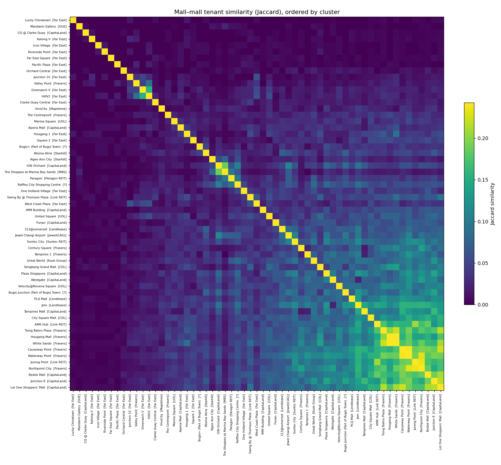
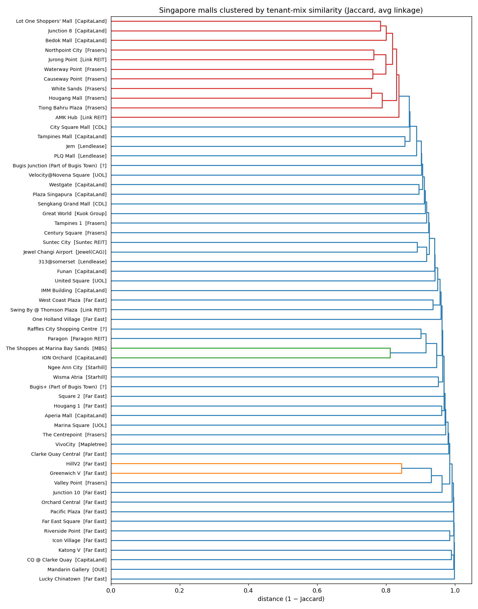

# Shopping — Data & Analytics

A catalogue of Singapore shopping centres, their corporate owners, and the **shops inside them** with a unified scope-of-business taxonomy. Six analytical lenses sit on top.

← [back to the index](../)

<a href="https://buymeacoffee.com/curioputterings" target="_blank"></a>

## Start here

→ **[10 Fun Questions About Singapore Malls](./FUN.md)** — bubble-tea capital, the secret-clone malls, the apocalypse-bunker mall, and more.

## Reports

| Report | What it answers |
| --- | --- |
| **[Overview](./REPORT.md)** | Coverage summary: shops by scope, malls by shop count, owners |
| **[Chain ubiquity](./ANALYTICS.md)** | Which brands appear in the most malls (retail and F&B leaderboards) |
| **[Owner / region breakdowns](./BREAKDOWNS.md)** | Counts by owner group, planning region, and grocery anchor |
| **[Mall similarity](./SIMILARITY.md)** | Jaccard / cookie-cutter / ARI on tenant mix — which malls overlap most |
| **[F&B cuisine mix](./CUISINE.md)** | Food & beverage shops bucketed into cultural cuisines |
| **[Brand provenance](./PROVENANCE.md)** | Singapore-origin vs. foreign brands across the dataset |
| **[REIT financials](./FINANCIALS.md)** | Per-mall shop count vs. NPI / yield for each REIT-owned property |

## Visualisations

| | |
| --- | --- |
|  |  |

## Data

| File | Rows | Description |
| --- | ---: | --- |
| [`data/malls.json`](./data/malls.json) / [`.csv`](./data/malls.csv) | 75 | Every shopping centre: corporate owner, owner group & type, address, postal code, planning region, nearest MRT, lat/long, shop & F&B counts |
| [`data/stores.json`](./data/stores.json) / [`.csv`](./data/stores.csv) | 4,258 | Every catalogued shop: name, mall, owner group, unit, level, scope of business, F&B flag, halal flag, description, website |
| [`data/malls_registry.json`](./data/malls_registry.json) | 73 | Raw research-assembled registry (owner / geo / transit) before merging |
| [`data/top_shops_retail.csv`](./data/top_shops_retail.csv), [`top_shops_fnb.csv`](./data/top_shops_fnb.csv) | — | Chain-ubiquity leaderboards |
| [`data/mall_similarity.csv`](./data/mall_similarity.csv), [`mall_cookiecutter.csv`](./data/mall_cookiecutter.csv) | — | Pairwise Jaccard and cookie-cutter scores |
| [`data/mall_financials.csv`](./data/mall_financials.csv) | — | Per-mall NPI / yield (REIT properties only) |
| [`data/fnb_cuisine.csv`](./data/fnb_cuisine.csv) | — | F&B shops with cultural cuisine bucket |
| [`data/provenance.csv`](./data/provenance.csv) | — | Per-brand SG / foreign tag |
| `data/*_stores.json`, `*_malls.json` | — | Per-operator intermediate outputs (one file per operator) |

### `stores` schema
```
name, mall, owner_group, unit, level, scope_of_business, raw_category,
subcategory, is_fnb, is_halal, description, website, source
```
`scope_of_business` is one of 14 unified categories: **Food & Beverage, Fashion & Accessories, Beauty & Wellness, Services, Department/Value/Outlet, Hobbies/Leisure/Entertainment, Health & Pharmacy, Sports & Fitness, Home & Living, Electronics & Technology, Kids & Children, Supermarket & Convenience, Jewellery & Watches, Books & Stationery**. `raw_category` keeps each operator's original label.

## Coverage

- **86 shopping centres** across **22 corporate owner groups** (CICT/CapitaLand, FCT/Frasers, Far East, Mapletree/MPACT, Lendlease, CDL, Allgreen, Paragon REIT, UOL, Suntec REIT, Starhill, SingLand, Link REIT, MBS, Jewel, …) — each with owner, address, region, transit.
- **59 centres have full shop-level listings** (8,869 shops, 3,234 F&B). Largest portfolios: CapitaLand (14 malls, 2,428 shops), Frasers (10 malls, 1,741 shops), Far East (15 malls, 831 shops), Link REIT (3 malls, 640 shops), Suntec City (396), Lendlease 313/Jem/PLQ (586), MBS Shoppes (214).
- The remaining ~40 centres are catalogued at the registry level (owner + geo + transit) but without shop lists.

## Limitations
- **Snapshot dated 2026-05-27.** Tenant mixes change frequently.
- **VivoCity is partial** — its public index exposes only ~89 of ~300+ shops; treated as best-effort and excluded from per-shop financial metrics.
- **City Square** has shop names + units but per-shop category only for F&B.
- All sources are public store directories.

## Support
If this dataset is useful to you, you can support continued maintenance: [Buy me a coffee ☕](https://buymeacoffee.com/curioputterings).
